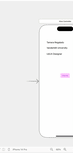

# Prework - Horizon 

Submitted by: Tamara Regalado Quiroz

Horizon is an app that changes the screen color with the tap of a button, changing your horizon to an unexpected one with a random color. 

Time spent: 2.5 hours spent in total

## Required Features

The following **required** functionality is completed:

- [ ] Users are see a screen with three labels and a button
- [ ] Tapping the button changes the screen color to a random color
 
## Video Walkthrough

Here's a walkthrough of implemented user stories:

<!-- Replace this with whatever GIF tool you used! -->
GIF created with Kap  
<!-- Recommended tools:
[Kap](https://getkap.co/) for macOS
[ScreenToGif](https://www.screentogif.com/) for Windows
[peek](https://github.com/phw/peek) for Linux. -->

## App Brainstorming (Step 4)
1. Notion 
    - minimalist design 
    - allows you to create all sorts of documents using a wide variety of templates 
    - connects across devices
2. Spotify
    - create unlimited amount of playlists 
    - gathers and recommends music for you based on your music taste 
    - includes a widget to have on home screen 
3. Duolingo 
    - interactive learning for free
    - incentivized learning with EXP and gems
    - great illustrations and graphics that give the app a storytelling aspect
4. Maps
    - Has options for map view, for example: transit and satellite
    - Displays weather
    - Suggests nearby places by categories
5. Calendar
    - Allows for color coding of task categories 
    - Displays calendar by year, month, and day with time stamps
    - Task time block with reminders and travel time
    
---APP IDEA------
An app I would like to build is an app that has a minimalist to do list. This app would allow you to create task categories to color code tasks or have an icon designated. Tasks can be created with or without reminders. This app would also implement a widget for the lock screen so that task can show up at the palm of your hand. In addition, ideally it would let you edit tasks from the lock screen, by swiping right to edit the task (name, time reminder, category) or swiping left to delete the task, like a notification interaction. 

## Notes

Describe any challenges encountered while building the app.
- I had a hard time understanding how to use and create the github repository, it was also a bit hard to understand some instructions since some stuff was named differently, however I was able to understand using the slack support group.  

## License

    Copyright [2023] [Tamara Regalado Quiroz]

    Licensed under the Apache License, Version 2.0 (the "License");
    you may not use this file except in compliance with the License.
    You may obtain a copy of the License at

        http://www.apache.org/licenses/LICENSE-2.0

    Unless required by applicable law or agreed to in writing, software
    distributed under the License is distributed on an "AS IS" BASIS,
    WITHOUT WARRANTIES OR CONDITIONS OF ANY KIND, either express or implied.
    See the License for the specific language governing permissions and
    limitations under the License.
